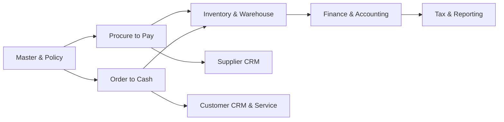

# Business Process

## Process Map

## Procure to Pay

1. User membuat PR berdasarkan kebutuhan, min-max, atau project.
2. Policy menentukan approval dan apakah RFQ diperlukan.
3. Buyer mengirim RFQ, menerima supplier quotation, lalu membuat comparison.
4. Buyer menerbitkan PO setelah approval; harga, tax, terms, dan delivery schedule menjadi snapshot.
5. Warehouse menerima barang; quality check menentukan accepted/rejected/quarantine.
6. AP mencatat supplier invoice dengan three-way match PO-receive-invoice.
7. Finance membuat payment berdasarkan due date, approval, dan bank balance.
8. Return mengurangi receipt/stock dan menghasilkan debit note sesuai policy.

## Order to Cash

Lead dikualifikasi menjadi customer/opportunity, quotation disetujui, SO dikonfirmasi, credit check dilakukan, warehouse melakukan allocation-picking-delivery, invoice diposting dari delivery/billing rule, payment direkonsiliasi, dan return menghasilkan credit note.

## Inventory to Finance

Setiap receipt, issue, transfer, adjustment, count, return, dan delivery menghasilkan stock movement. Posting movement memanggil inventory accounting policy (FIFO/average), membentuk journal, dan menyimpan reference yang immutable.

## Control Gates

| Gate | Kontrol |
|---|---|
| Master | Active status, duplicate, tax/currency/unit valid |
| Approval | Amount, margin, credit, exception, segregation of duties |
| Posting | Period open, source complete, balance, permission |
| Fulfillment | Availability, reservation, lot/serial/expiry |
| Settlement | Match, bank/cash account, duplicate payment |
| Closing | Reconciliation, unresolved exception, lock period |

## Exception Handling

Exception tidak boleh diselesaikan dengan edit langsung. Buat task/approval/reversal/return, simpan reason code, evidence attachment, actor, dan resolution timestamp.
