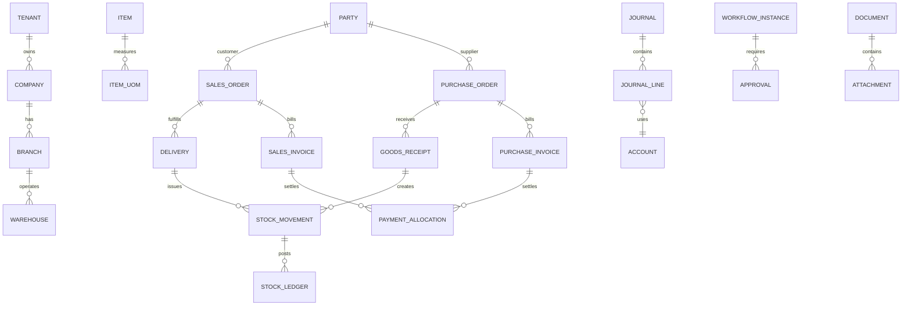

# ERD

## Core Relationship

## Cardinality Rules

One header has one or more lines when submitted. One source can have many downstream documents, but downstream quantity/value cannot exceed source unless explicit over-receive/over-delivery policy. A posting may reference exactly one source event and can generate multiple journal lines.

## Detailed Model Source

Authoritative columns, indexes, FK, constraints, and seed data are in `09-TABLE-SPECIFICATION.md`; accounting and inventory subledgers are in `21-ACCOUNTING.md` and `22-INVENTORY.md`.
