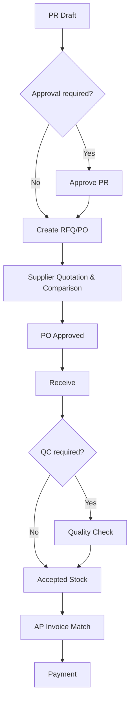
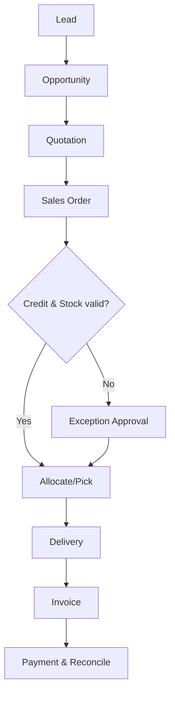

# Flowchart

## Purchase

## Sales

## Reversal Principle

Rejected node creates a reasoned exception. Posted node goes only to cancel/reverse/return according to `12-STATES.md`; no direct database transition.
