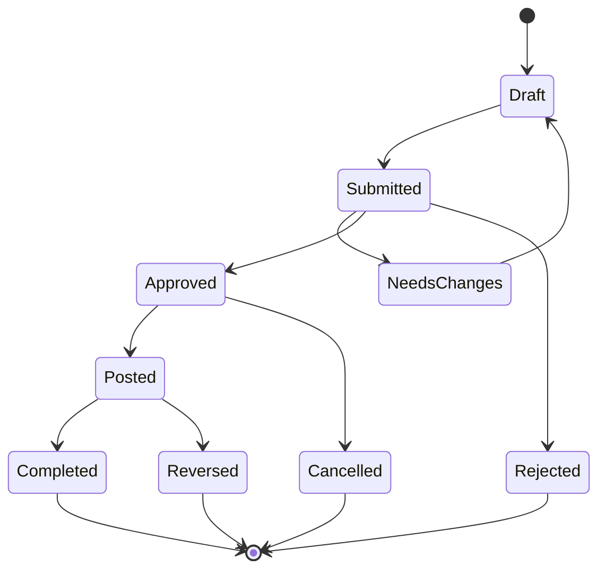

# States

## Common State Machine

## State Rules

| State | Editable | Financial/stock effect | Allowed actor |
|---|---|---|---|
| Draft | Yes | None | Creator + edit permission |
| Submitted | No | None | Approver/reviewer |
| Approved | No | None or reservation per policy | Executor |
| Posted | No | Yes | Post permission |
| Completed | No | Already settled | Read only |
| Cancelled | No | Reversal if posted | Authorized manager |
| Reversed | No | Counter-entry exists | Authorized accountant/manager |

## Entity States

PR: Draft/Submitted/Approved/Converted/Closed/Cancelled. PO: Draft/Pending Approval/Approved/Partially Received/Fully Received/Closed/Cancelled. Receipt: Draft/Received/QC/Accepted/Rejected/Posted/Reversed. SO: Draft/Submitted/Approved/Partially Delivered/Fully Delivered/Closed/Cancelled. Invoice: Draft/Submitted/Approved/Posted/Partially Paid/Paid/Overdue/Void/Reversed. Ticket: New/Open/Pending/Resolved/Closed/Reopened.
