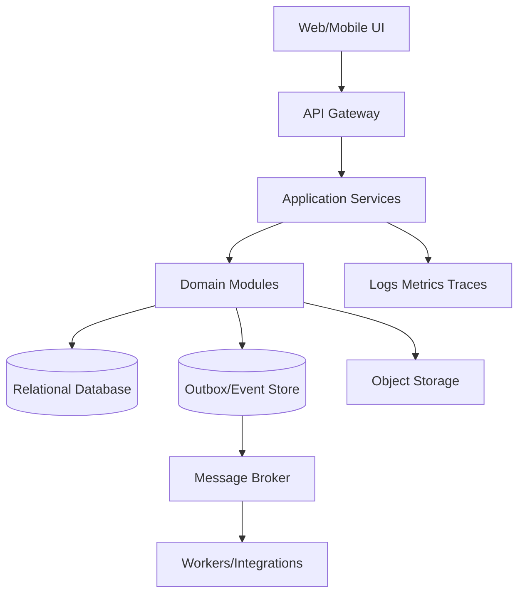

# Architecture

## Logical Architecture

## Boundaries

Modules own their domain rules and repositories; cross-module orchestration uses application service/events, not direct table mutation. Accounting and stock posting are transactional with source document. Reports use read models/materialized views, never bypass permission.

## Deployment and Scale

Stateless app workers, queue workers, relational primary/replica where safe, cache for reference/read only, object storage, observability, and tenant-aware partitioning. Strong consistency for posting; eventual for notification, search, and analytics.
